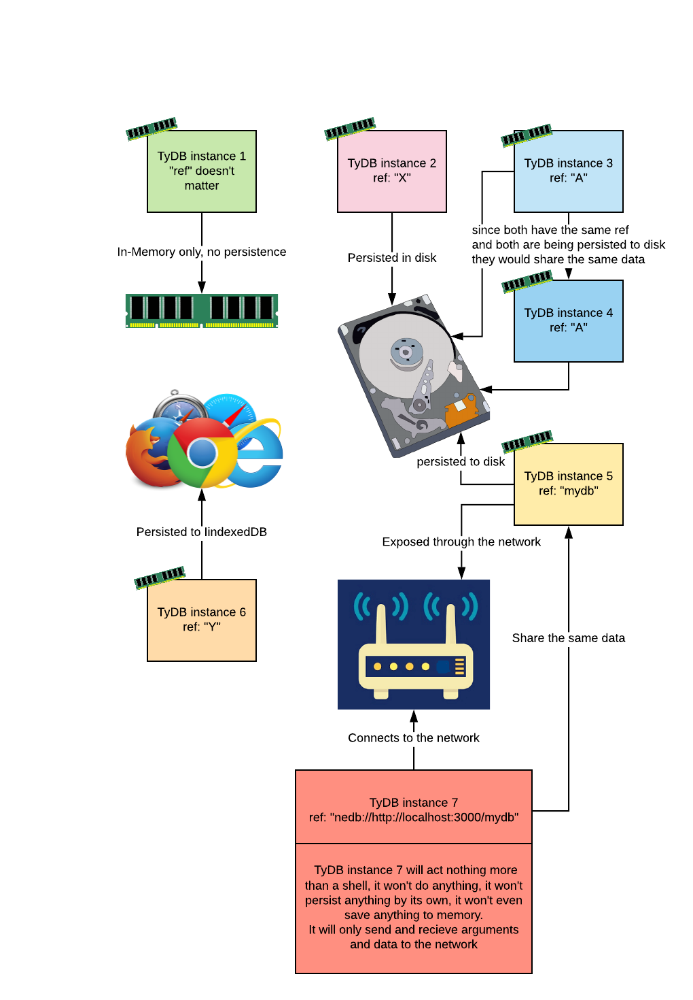

# TyDB

## Introduction

TyDB is a database system written in typescript, its goal is to provide a strongly-typed database experience with an API and a query language similar to MongoDB.

* It can be in-memory, or persistent \(using a persistence adapter\).
* It can be used with NodeJS or in the browser.
* It can be embedded or served over a network \(like MongoDB\).
* The query language and the API is very similar to MongoDB, \(except for the dot notation\) and the difference is only to provide and experience with maximum type declaration.
* Persisted in a flat file when in node \(using a persistence adapter\), persisted in IndexedDB when in the browser \(using another adapter\), and you can easily write your own adapter too.
* Can deal with large data sets \(tested against 1GB of data\) and won't take too much memory.
* It is fast.
* It is light-weight \(45 KB, not gzipped\).

