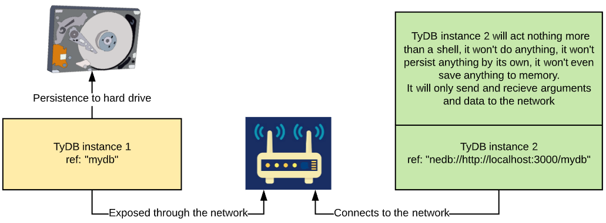

# Over the Network



### Running a network-exposed instance

When you install tydb locally \(`npm i tydb`\) or globally \(`npm i -g tydb`\), you'll get a CLI tool to run a network exposed instance of TyDB.

Before you run the command, you'll have to setup a configuration file like this



```javascript
const tydb = require("tydb");
const BaseModel = tydb.BaseModel;
const adapter = tydb.FS_Persistence_Adapter;

/**
* Define your model
*/
class MyModel extends BaseModel {
	constructor() {
		super();
		this.name = "";
		this.male = false;
	}
	get female() {
		return !this.male;
	}
}

module.exports = {
	/**
	 * you can define multiple database
	 * to be exposed over the network
	 */
	databases: {
		// "ns1" will be used as a namespace for
		// the database connection URL
		// (e.g. nedb://http://localhost:3000/ns1)
		ns1: {
			// "workspace/external" is the file
			// path that the database
			// data will be saved to
			ref: "a/path/to/a/file",
			// a model that your documents
			// will confirm to
			model: MyModel,
			afterSerialization: (string) => {
				// if you want to do any
				// special encoding/encryption
				return string;
			},
			beforeDeserialization: (string) => {
				// if you want to do any
				// special decoding/decryption
				return string;
			},
			// no tolerance for corruption
			corruptAlertThreshold: 0,
			// add createdAt & updatedAt fields
			timestampData: true,
			// use a persistence adapter
			// (defaults to file system)
			persistence_adapter: FS_Persistence_Adapter,
			// set an interval for auto compaction
			// defaults to 0 = no auto compaction
			autoCompaction: 0,
		},
		ns2: {
			ref: "a/path/to/a/file2",
			model: MyModel2,
			// ... etc
		}
	},

	/**
	 * fastify server configurations
	 */
	fastify: {
		// listening options
		// more: https://www.fastify.io/docs/latest/Server/#listen
		listen: {
			port: 3000,
			host: "127.0.0.1",
		},
		// server options
		// more: https://www.fastify.io/docs/latest/Server/
		server: {
			logger: false,
		},
		// set this to undefined to disable cors
		// more: https://github.com/fastify/fastify-cors
		cors: {},
	},
};
```



* Each property in the `databases` field represents a database, the key of this property \(e.g. `ns1`\) is the namespace that you would use to connect to this specific database. The value of this property is the database configuration. [Read more about database configuration](database-configurations.md).
* TyDB uses [fastify](https://www.fastify.io/) framework to serve the database over the network. Hence the fastify field contains configurations related to fastify.
  * [Read more about listening options](https://www.fastify.io/docs/latest/Server/#listen).
  * [Read more about server options](https://www.fastify.io/docs/latest/Server/).
  * [Read more about CORS options](https://github.com/fastify/fastify-cors#options).

### Using a node process manager

To run such TyDB in production you may need to have some kind of process manager, this is not included to give you more freedom and choice over which process manager you'd like to have, here's an example of how to do it using PM2 as an example.

After installation of TyDB and PM2 and creating your configs file \(e.g. `tydb.config.js`\) run this command:

```bash
pm2 start node_modules/.bin/tydb -- tydb.config.js
```

If you have TyDB globally installed, then run `npm root -g` to locate the directory in which TyDB is installed. The `bin.js` file is found in `dist` directory, so your pm2 command may look like this:

```text
pm2 start ~/.nvm/versions/node/v10.15.0/lib/node_modules/tydb/dist/bin.js -- tydb.config.js
```

After running the pm2 start command, run the log command

```bash
pm2 log
```

There shouldn't be any errors being logged. And to make sure that your database is being served over the network, head to your browser and type in the host name with the port \(e.g. `http://localhost:3000`\), and you should be greeted with a response like this one:

```bash
{
    "tydb":"welcome",
    "status":"ok",
    "version":"0.5.3"
}
```

And when adding the database namespace to the URL \(e.g. `http://localhost:3000/ns1`\) and you should see a message like this one:

```bash
{
    "tydb":"welcome",
    "dbNamespace":"mydb",
    "databaseFound": true,
    "datafile":"/a/path/to/file",
    "indexesFile":"/a/path/to/file.idx.db"
}
```

### Connecting to the remote instance

Finally, to connect to the database that you've created above, use the connection URL as described in [database configuration documentation](database-configurations.md#ref) as the `ref`.

```typescript
import { Database, BaseModel} from "tydb";

class MyModel extends BaseModel {
    name: string = "alex";
    yearBorn: number = 1992;
}

const mydb = new Database<MyModel>({
    // notice how the "ref" must
    // start with a "tydb://"
    // and end with the namespace
    // "ns1"
    ref: "tydb://http://localhost:3000/ns1",
    // the same model that you used
    // on the configuration file of the
    // network database should be used
    model: MyModel,
    // all other configuration will be ignored
});
```

