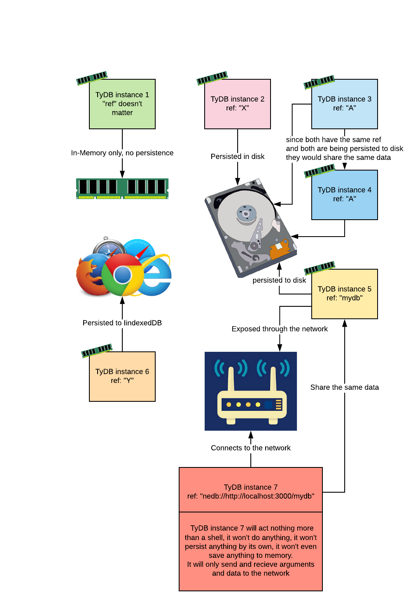

# Persistence Adapters

By default, if not [explicitly stated](database-configurations.md#persistence_adapter), the database will use no persistence layer, all the data will live solely in memory and will be lost once you exit the application or database instance is lost or deleted. This behavior might be what you want. Yet, most of the use cases for the database involve some form of data persistence.

TyDB doesn't rely on one form of database persistence, rather it introduces the concept of pluggable persistence adapter. Since the database might be used in different environment and for different use cases, different adapter have been written. And you would "plug" the adapter that best suits your need. So, when running in the browser, you may want to use the IndexedDB adapter, and when running in NodeJS you may want to use the File system adapter.



### File System persistence adapter

```typescript
import { Database, FS_Persistence_Adapter } from "tydb";

const mydb = new Database({
    ref: "a-database-name",
    persistence_adapter: FS_Persistence_Adapter,
});

```

[Read more about the file system persistence](file-system-persistence.md)

### IndexedDB persistence adapter

```typescript
import { Database, IDB_Persistence_Adapter} from "tydb";

const mydb = new Database({
    ref: "a-database-name",
    persistence_adapter: IDB_Persistence_Adapter,
});

```

[Read more about the browser and IndexedDB persistence](in-the-browser.md)


**Note:** in case that the instance is connecting to another instance over the network \(i.e. has a `ref` like this: `tydb://http://localhost:3000/mydb`\), the `persistence_adapter` parameter will be ignore \(like all other parameters, other than `ref` & `model`\) and it will act like a shell only responsible for sending arguments and receiving data. The persistence defined in the network database configuration will actually be use.

[Read More about over-the-network instances.](over-the-netowrk.md)


### Write your own persistence adapter

Writing and plugging your own persistence adapter is fairly easy, start by extending the persistence class and overwrite some methods like the example below

```typescript
import { Persistence, PersistenceEvent } from "tydb";

/**
* The following adapter is an example
* of how you can write your own adapters.
* This is basically an implenetation of a
* in-memory adapter.
*/

class Memory_Persistence_Adapter extends Persistence {
	/**
	 * You will need two separate storages,
	 * e.g. arrays, files, hash maps ... etc
	 * one for the documents, and the other
	 * for the indexes
	 */
	_memoryIndexes: string[] = [];
	_memoryData: string[] = [];

	/**
	 * This method will be executed once
	 * the database is created,
	 * before initialization
	 */
	async init() {}

	/**
	 * If the persistence layer is being locked,
	 * you should provide
	 * a method for forcing an unlock
	 */
	async forcefulUnlock() {}

	/**
	 * (A) READING
	 * =============
	 * two methods, one for indexes and
	 * the other for documents, each read
	 * method should utilize the event parameter,
	 * and once a line becomes available it
	 * should "emit" it like the examples below
	 */
	async readIndexes(event: PersistenceEvent) {
		for (let i= 0; i< this._memoryIndexes.length; i++) {
			const line = this._memoryIndexes[i];
			event.emit("readLine", line);
		}
		event.emit("end", "");
	}
	
	async readData(event: PersistenceEvent) {
		for (let i= 0; i< this._memoryData.length; i++) {
			const line = this._memoryData[i];
			event.emit("readLine", line);
		}
		event.emit("end", "");
	}

	/**
	 * (B) WRITING
	 * =============
	 * two methods, one for indexes
	 * and the other for documents each write
	 * method should utilize the event parameter,
	 * and a callback should be provided for
	 * when the line is received also a callback
	 * should be provided for the end of the database
	 * is reached. the on.end callback would be utilized
	 * for example for closing a database,
	 * a connection, a file ...etc
	 */
	async rewriteIndexes(event: PersistenceEvent) {
		this._memoryIndexes = [];
		event.on("writeLine", async (data) => {
			this._memoryIndexes.push(data);
		});
		event.on("end", async () => {
			// code to be executed once we're
			// finished with the last line of the database
		});
	}
	
	async rewriteData(event: PersistenceEvent) {
		this._memoryData = [];
		event.on("writeLine", async (data) => {
			this._memoryData.push(data);
		});
		event.on("end", async () => {
			// code to be executed once we're
			// finished with the last line of the database
		});
	}

	/**
	 * (C) APPENDING
	 * ===============
	 * two methods, one for indexes
	 * and the other for documents. for quick
	 * appending to the persistence layer,
	 * like pushing onto an array, appending to a file,
	 * adding a record to a hashmap ... etc
	 */
	async appendIndex(data: string) {
		this._memoryIndexes.push(data);
	}
	async appendData(data: string) {
		this._memoryData.push(data);
	}
}
```

For more elaborate example checkout [the adapter that are shipped with the database on github](https://github.com/alexcorvi/tydb/tree/master/src/adapters).

